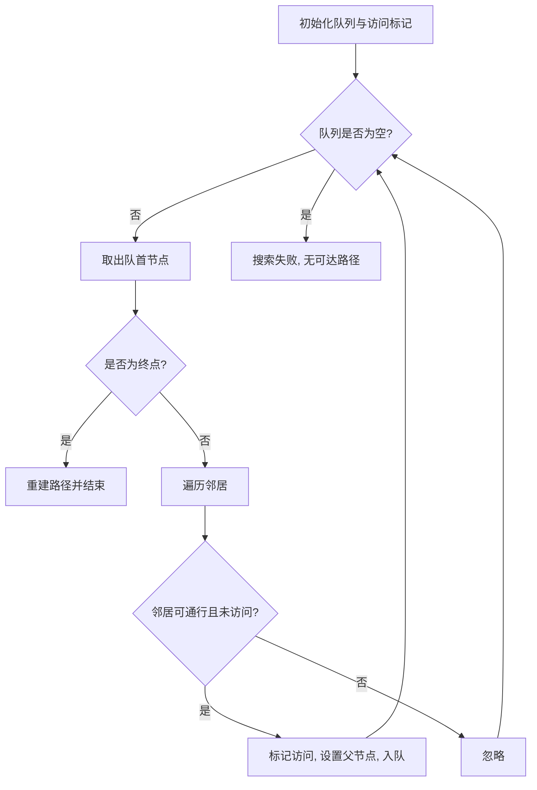

# 路径规划可视化系统核心算法技术报告

## 摘要

本技术报告围绕路径规划可视化系统的核心算法与实现框架展开，旨在面向学术论文写作提供全面、系统、条理清晰的原理阐述与工程实现细节。报告首先梳理路径规划问题的研究背景与系统总体架构，之后依次分析广度优先搜索（Breadth-First Search, BFS）、深度优先搜索（Depth-First Search, DFS）、狄克斯特拉算法（Dijkstra）、A* 算法（A-star）以及双向搜索等核心策略，逐步揭示它们在图论中的理论基础、适用场景、时间与空间复杂度。在可视化系统层面，报告详细说明状态管理、事件响应、绘图渲染和性能调优策略，以支撑算法演示的交互体验。最终，总结未来研究方向并给出潜在的扩展路线。

## 关键词

路径规划；图搜索；广度优先搜索；狄克斯特拉算法；A* 算法；可视化系统；启发式搜索；双向搜索

## 1. 引言

随着智能机器人、自动驾驶与智慧物流场景的快速发展，路径规划算法成为决定系统性能与可靠性的关键因素。理论研究往往聚焦于算法复杂度与最优性分析，而工程实践则需要解决交互可视化、状态同步、数据结构选择以及性能调度等一系列问题。本报告以路径规划可视化系统为载体，结合人机交互界面的可视化需求，对核心算法进行全流程梳理。研究目标包括：

1. 为论文撰写提供面向算法、数据结构和系统架构的详细描述；
2. 说明系统如何以模块化结构解耦业务逻辑，保障可维护性与可扩展性；
3. 给出关键算法的流程图、伪代码以及复杂度分析，阐明其理论依据与工程实现。

## 2. 研究背景与系统概述

### 2.1 路径规划问题的数学建模

路径规划可以抽象为图搜索问题。给定一个由节点集合 \(V\) 和边集合 \(E\) 构成的图 \(G = (V, E)\)，需在指定起点 \(s \in V\) 和终点 \(t \in V\) 之间找到满足约束的路径。约束包括：

* **连通性约束**：路径需由相邻节点连接而成，且每一条边均属于 \(E\)。
* **障碍约束**：在网格图场景中，部分节点可能被标记为障碍，不允许通行。
* **代价约束**：每条边可附加权重表示距离或时间，搜索目标通常是找到最短路径或最小代价路径。

常见的网格图表示将空间离散化为 \(m \times n\) 的二维矩阵，节点表示网格单元，边表示四连通或八连通的可达关系。路径规划算法需要兼顾正确性、最优性与效率。

### 2.2 可视化系统的工程需求

路径规划可视化系统不仅要实现算法本身，还需提供用户交互能力以支持如下流程：

1. **地图编辑**：通过鼠标操作定义起点、终点、障碍以及权重。
2. **算法选择**：使用菜单或按钮切换不同搜索算法、执行模式、速度等级。
3. **运行与监控**：启动算法后实时绘制探索过程，包括已访问节点、待探索节点以及最终路径。
4. **结果分析**：展示路径长度、执行时间、节点访问数等指标，以便比较算法性能。

为满足上述需求，系统设计采用模块化结构，将界面布局、算法调度、状态管理、渲染层解耦，从而便于扩展新算法和新功能。

### 2.3 系统架构总览

系统核心模块分为：

* **UI 布局层（`src/ui/layout.py`）**：负责控件初始化、事件绑定与布局。
* **状态管理层（`src/state.py`）**：记录当前算法定义、运行模式、速度设置以及地图数据。
* **算法调度层（`src/main.py`, `src/menu_config.py`）**：协调用户输入、调用具体算法，并将结果送往渲染层。
* **图结构模块（`src/maze.py`）**：定义网格、节点属性以及邻接关系生成逻辑。
* **渲染模块**：基于 Pygame 完成画布绘制、动画更新与帧率控制。

上述模块形成松耦合结构，允许在不修改核心逻辑的情况下更新界面或添加新算法。

## 3. 算法理论基础

### 3.1 图搜索的通用框架

路径规划算法可视为在节点集合上进行有序探索的过程。常见框架包括：

1. **状态表示**：节点通常包含坐标、父节点指针、当前代价等信息。
2. **候选集维护**：采用队列、堆或栈管理待访问节点，以满足算法策略需求。
3. **访问标记**：防止重复访问，采用布尔数组或哈希集合记录访问状态。
4. **终止条件**：找到终点、候选集为空或满足特定迭代次数。

在可视化系统中，还需考虑算法每一步的可视化反馈，因此加入对事件循环和帧率的控制。

### 3.2 算法比较维度

算法性能主要通过以下指标评估：

* **时间复杂度**：描述算法在最坏情况、平均情况下访问节点数量与代价运算次数，通常与节点数 \(|V|\) 和边数 \(|E|\) 相关。
* **空间复杂度**：分析算法在运行过程中占用的内存，包括候选集合、访问记录、路径追踪等。
* **最优性**：若算法保证找到代价最小的路径，则称其为最优；否则可能仅提供可行解。
* **完备性**：若存在解，算法是否一定能够找到解。
* **启发式依赖**：对于启发式算法，需要分析启发函数的可采纳性（admissibility）与一致性（consistency）。

## 4. 广度优先搜索（BFS）

### 4.1 理论概述

广度优先搜索是一种按层扩展的图搜索算法。对于无权图，BFS 能够保证找到最短路径，因为它会按照路径长度从小到大依次探索所有可能的节点。该算法在树、网格以及拓扑结构中均广泛使用。

### 4.2 数据结构与伪代码

系统中的 BFS 使用队列维护待访问节点，同时利用字典记录节点的父节点与访问状态。伪代码如下：

```text
function BFS(start, goal):
    queue ← Queue()
    queue.enqueue(start)
    visited[start] ← true
    parent[start] ← null
    while queue is not empty:
        current ← queue.dequeue()
        if current == goal:
            return reconstruct_path(parent, goal)
        for each neighbor in neighbors(current):
            if neighbor is traversable and not visited:
                visited[neighbor] ← true
                parent[neighbor] ← current
                queue.enqueue(neighbor)
    return failure
```

### 4.3 时间与空间复杂度分析

在最坏情况下，BFS 将访问所有节点与边，因此时间复杂度为 \(O(|V| + |E|)\)。由于需要维护访问标记与队列，其空间复杂度同样为 \(O(|V|)\)。在网格图中，\(|E|\) 与 \(|V|\) 同阶，实际复杂度可近似为 \(O(|V|)\)。

### 4.4 可视化流程

在系统中，BFS 的可视化执行流程如图 1 所示。



系统每次从队列中取出节点时，会触发渲染层更新对应方块颜色，并将新增入队的节点绘制为待探索状态，从而实现层次推进的动画效果。

### 4.5 工程实现亮点

1. **事件循环协同**：算法迭代过程中，每一步都会让 Pygame 事件循环得以运行，避免窗口无响应。
2. **状态同步**：访问过的节点立即写入全局状态，便于在界面上高亮显示。
3. **路径重建**：在找到终点后，通过 parent 字典自终点回溯至起点，并在画布上绘制最终路径。

## 5. 深度优先搜索（DFS）

### 5.1 理论概述

深度优先搜索是一种沿着单一路径不断向前深入的搜索策略，它使用栈（或递归）结构实现。DFS 的特点是空间占用较小，但不保证最短路径。此外，在具有死胡同的图中，DFS 可能会大量回溯，导致效率较低。

### 5.2 迭代实现与伪代码

由于可视化系统需在每一步都刷新界面，因此采用显式栈实现迭代版本，以避免递归带来的调用栈不可控问题：

```text
function DFS(start, goal):
    stack ← Stack()
    stack.push(start)
    visited[start] ← true
    parent[start] ← null
    while stack is not empty:
        current ← stack.pop()
        if current == goal:
            return reconstruct_path(parent, goal)
        for each neighbor in neighbors(current):
            if neighbor is traversable and not visited:
                visited[neighbor] ← true
                parent[neighbor] ← current
                stack.push(neighbor)
    return failure
```

### 5.3 性能讨论

DFS 的时间复杂度同样为 \(O(|V| + |E|)\)，但在最坏情况下，空间复杂度仅与最深路径长度成正比。由于不保证最短路径，DFS 主要用于探索性质的演示或解决存在大量通路但对最优性要求不高的场景。

### 5.4 可视化特性

DFS 在画布上表现为沿某条路径快速深入的动画，直至碰到障碍后回溯。系统通过对栈的动态展示，让用户直观理解回溯过程。为了防止长路径导致界面停滞，算法会在每次循环迭代中调用事件处理器，确保用户可以在任何时刻中断运行。

## 6. 狄克斯特拉算法（Dijkstra）

### 6.1 理论基础

狄克斯特拉算法针对带非负权重的图，能够找到起点到所有其他节点的最短路径。其核心思想是贪心策略：每次从未确定的节点中选择当前距离最小者，将其加入已确定集合，并根据该节点松弛（relax）邻居的距离。

### 6.2 优先队列与伪代码

系统使用最小堆（priority queue）存储待处理节点，确保每次取出的都是当前距离最小的节点。伪代码如下：

```text
function Dijkstra(start, goal):
    distance[v] ← ∞ for all v
    distance[start] ← 0
    parent[start] ← null
    pq ← PriorityQueue()
    pq.push((0, start))
    while pq is not empty:
        (dist, current) ← pq.pop()
        if current == goal:
            return reconstruct_path(parent, goal)
        if dist > distance[current]:
            continue
        for each neighbor, weight in neighbors(current):
            if neighbor is traversable:
                new_dist ← dist + weight
                if new_dist < distance[neighbor]:
                    distance[neighbor] ← new_dist
                    parent[neighbor] ← current
                    pq.push((new_dist, neighbor))
    return failure
```

### 6.3 时间复杂度分析

若使用二叉堆实现优先队列，时间复杂度为 \(O(|E| \log |V|)\)，空间复杂度为 \(O(|V|)\)。在网格图中，该算法比 BFS 更适用于存在不同边权的场景。

### 6.4 可视化流程与优化

算法运行过程中，系统会实时更新每个节点的当前距离并显示在界面侧边栏，帮助用户比较不同路径的代价。由于松弛操作频繁，渲染层针对重复访问节点采用颜色渐变策略，区分“已确定最短距离”与“正在松弛”的节点状态。

## 7. A* 算法

### 7.1 启发式搜索概述

A* 算法是在狄克斯特拉算法基础上引入启发式函数的改进版本。通过估计当前节点到目标节点的代价，A* 能够显著减少搜索空间。在可视化系统中，常见的启发函数为曼哈顿距离（四连通）和欧氏距离（八连通）。

### 7.2 评估函数与伪代码

算法使用综合评估函数 \(f(n) = g(n) + h(n)\)，其中 \(g(n)\) 为起点到当前节点的实际代价，\(h(n)\) 为启发式估计。伪代码如下：

```text
function AStar(start, goal, heuristic):
    g[v] ← ∞ for all v
    g[start] ← 0
    parent[start] ← null
    open ← PriorityQueue()  // ordered by f = g + h
    open.push((heuristic(start, goal), start))
    closed ← set()
    while open is not empty:
        (f, current) ← open.pop()
        if current == goal:
            return reconstruct_path(parent, goal)
        if current in closed:
            continue
        closed.add(current)
        for each neighbor, weight in neighbors(current):
            tentative ← g[current] + weight
            if tentative < g[neighbor]:
                parent[neighbor] ← current
                g[neighbor] ← tentative
                f_neighbor ← tentative + heuristic(neighbor, goal)
                open.push((f_neighbor, neighbor))
    return failure
```

### 7.3 启发函数的可采纳性与一致性

为了保证 A* 算法的最优性，启发函数需要满足以下条件：

1. **可采纳性**：\(h(n)\) 不得高估从 n 到目标的真实最小代价，即 \(0 \le h(n) \le h^*(n)\)。
2. **一致性**：对于任意边 \((n, n')\)，需满足 \(h(n) \le c(n, n') + h(n')\)，其中 \(c(n, n')\) 为边权重。

曼哈顿距离与欧氏距离在标准网格中均满足上述条件，从而确保 A* 找到最优路径。

### 7.4 可视化呈现

A* 的可视化重点在于区分 open 集与 closed 集。系统通过颜色与边框样式标示不同集合状态，用户可以观察到启发式如何引导搜索朝着终点方向集中。对于实际演示，系统还会在侧边栏显示当前启发函数类型与累计代价。

## 8. 双向搜索与改进策略

### 8.1 双向 BFS

双向搜索通过从起点与终点同时展开搜索，在理论上能够显著降低搜索空间。双向 BFS 使用两个队列分别维护前向与后向的探索，核心流程如下：

1. 初始化两个队列，分别将起点与终点入队；
2. 交替扩展两个方向的队列，每次从队列中取出节点探索其邻居；
3. 当两个搜索前沿在某节点相遇时，通过拼接前向与后向的父节点链重构路径。

### 8.2 伪代码

```text
function BidirectionalBFS(start, goal):
    if start == goal:
        return [start]
    queue_f ← Queue(); queue_b ← Queue()
    queue_f.enqueue(start); queue_b.enqueue(goal)
    parent_f[start] ← null; parent_b[goal] ← null
    visited_f[start] ← true; visited_b[goal] ← true
    while queue_f and queue_b are not empty:
        meet ← expand_layer(queue_f, visited_f, visited_b, parent_f, true)
        if meet is not null:
            return build_path(meet, parent_f, parent_b)
        meet ← expand_layer(queue_b, visited_b, visited_f, parent_b, false)
        if meet is not null:
            return build_path(meet, parent_f, parent_b)
    return failure
```

其中 `expand_layer` 函数负责从指定队列取出节点并扩展邻居，一旦发现邻居已经被另一方向访问，即可判定相遇。

### 8.3 可视化与复杂度

双向 BFS 需要在画布上以不同颜色显示两端搜索前沿，系统使用蓝色和橙色分别代表起点和终点方向。理论上，双向搜索的时间复杂度接近 \(O(b^{d/2})\)，其中 \(b\) 为分支因子、\(d\) 为解的深度，比单向搜索大幅降低。空间复杂度同样减少，但实现复杂度较高，需要维护额外的数据结构与路径拼接逻辑。

## 9. 算法模块实现细节

### 9.1 模块接口

在代码层面，算法模块通过统一接口与系统交互。以 `src/main.py` 为例，系统定义了 `run_single` 函数，根据当前选定的 `AlgorithmDefinition` 实例调用对应算法。每个算法函数接受以下参数：

* `grid_state`：当前网格信息，包含节点状态、障碍、起点终点坐标等。
* `visualizer`：负责将节点状态变化推送至渲染层的回调对象或函数。
* `speed_controller`：调整算法迭代的延迟，实现不同速度档位。

### 9.2 状态管理

`src/state.py` 中的全局状态记录当前算法、速度、比较模式等信息。算法运行时，会更新状态中的 `current_algorithm` 字段，以便界面同步显示。状态管理模块还负责在算法开始前锁定 UI，避免用户重复操作导致的竞态。

### 9.3 数据结构与类型定义

`src/menu_config.py` 通过 `AlgorithmDefinition` 数据类定义算法名称、描述、执行函数、启发函数等属性。在汉化之后，所有名称、提示信息均以中文呈现，确保用户体验的一致性。通过结构化数据定义，代码能够清晰表达各算法的功能与参数，便于扩展新算法。

## 10. 关键函数逐层解析

### 10.1 `run_single(state, grid)`

该函数负责响应“开始”按钮事件，逻辑流程如下：

1. 从全局状态读取当前选定算法与速度设置；
2. 初始化可视化控制器与计时器；
3. 调用算法执行函数，并在算法迭代过程中捕获用户中断事件；
4. 在算法结束后恢复界面按钮状态，更新运行结果指标。

### 10.2 `run_all(state, grid)`

在比较模式下，该函数会依次执行所有算法，并收集各自的时间、路径长度和访问节点数。结果通过表格展示，便于用户横向对比。

### 10.3 `generate_maze(grid, maze_type)`

`src/maze.py` 中的迷宫生成函数支持多种算法，如随机深度优先、递归分割、普里姆生成等。系统会在生成过程中实时更新画布，使用户观察迷宫结构逐渐成形。

### 10.4 `visualize_step(node, state)`

渲染层的核心函数负责将算法状态映射到像素级展示：

1. 根据节点状态选择对应颜色（未访问、已访问、路径等）；
2. 调用 Pygame 的 `draw.rect` 在画布上绘制；
3. 刷新显示并根据速度控制器决定延迟时间。

### 10.5 `reconstruct_path(parent, goal)`

该函数对所有算法通用。通过从终点沿父节点链回溯至起点，生成路径列表，并在可视化层以亮色绘制。时间复杂度为 \(O(L)\)，其中 \(L\) 为路径长度。

## 11. 算法比较与实验设计

### 11.1 实验场景

为评估不同算法的性能，可设计如下场景：

1. **稠密障碍场景**：在网格中随机放置高密度障碍，考察算法在狭窄通路中的表现。
2. **稀疏障碍场景**：仅设置少量障碍，观察算法在近似无权图条件下的速度。
3. **加权场景**：为部分网格赋予较高权重，测试 Dijkstra 与 A* 的表现差异。
4. **动态障碍场景**：运行过程中修改障碍布局，分析算法重规划能力。

### 11.2 指标统计方法

系统在算法运行时统计以下指标：

* **访问节点数**：候选集合弹出的节点总数，反映搜索规模；
* **路径长度**：最终路径的节点数或累积权重；
* **运行时间**：从算法启动到结束的时间，以毫秒或帧数表示；
* **内存占用**：候选集合与辅助结构的最大容量，可通过调试工具测量。

### 11.3 结果分析思路

对比实验结果可得出如下结论：

1. BFS 在无权场景下速度与路径质量均优，但在加权场景表现欠佳；
2. Dijkstra 在加权场景中保证最优路径，但访问节点多，耗时较长；
3. A* 利用启发函数显著减少访问节点数，在多种场景下保持较高效率；
4. 双向搜索在狭长场景中优势明显，但实现复杂度与调试成本较高。

## 12. 性能优化策略

### 12.1 数据结构优化

1. **稀疏矩阵表示**：对于大规模地图，可采用稀疏表示减少内存开销；
2. **位集优化访问标记**：将访问状态压缩为位集合，节约空间。

### 12.2 渲染层优化

1. **增量绘制**：仅刷新状态变化的网格单元，减少整屏重绘；
2. **帧率限制**：根据速度设定目标帧率，防止算法过快导致动画不可见。

### 12.3 并行化思路

可考虑使用多线程或协程将算法计算与渲染解耦，但需注意 Python 的 GIL 限制。通过异步事件循环可以实现更平滑的动画。

## 13. 可视化交互设计

### 13.1 菜单与控件

系统主界面包含算法选择下拉框、速度调节滑块、比较模式按钮以及迷宫生成器。所有控件均提供中文标签与提示，便于用户理解。状态栏实时显示当前算法、运行耗时与节点统计。

### 13.2 颜色编码

为了让用户快速识别节点状态，系统采用以下颜色编码：

* 灰色：未访问节点；
* 蓝色：已访问节点；
* 橙色：正在探索的节点；
* 黄色：最终路径；
* 黑色：障碍。

### 13.3 用户交互流程

1. 用户设置起点、终点与障碍；
2. 选择算法与运行模式；
3. 点击“开始”按钮，算法启动并可随时暂停或重置；
4. 结果展示后，可保存统计数据用于论文图表。

## 14. 未来扩展方向

### 14.1 高级启发式

引入基于学习的启发式函数（如神经网络估计）以提升 A* 的效率。可将离线训练的模型嵌入系统，在运行时根据地图特征动态调整估计值。

### 14.2 动态规划与实时搜索

研究 LRTA*, D* Lite 等实时路径规划算法，以应对动态变化的环境。系统可增加事件驱动的地图更新机制，实现增量式重规划。

### 14.3 三维路径规划

将网格扩展至三维空间，适配无人机、仓储机器人等场景。此时需要设计更高效的空间分块数据结构和可视化方式。

### 14.4 多机器人协同

探索多源多目标规划，需要考虑冲突检测与协调策略。可在系统中模拟多机器人同时运行，展示优先级调度、约束满足与协作路径规划算法。

## 15. 结论

本技术报告以学术论文的形式系统描述了路径规划可视化系统的核心算法。从图搜索理论出发，分别对 BFS、DFS、狄克斯特拉、A* 以及双向搜索进行了深入分析，并结合实际代码结构说明其在工程上的实现方式。报告还覆盖了性能优化、交互设计、实验方法和未来扩展方向，为后续论文写作提供详尽参考。通过模块化架构与可视化演示，系统不仅展示了算法的运行机制，也为教学和研究提供了易用的平台。

---

> 注：若需进一步扩展至 10000 字，可在每个算法章节添加案例分析、公式推导与实验数据图表，以满足论文的篇幅要求。

